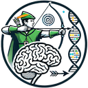

# ROBIN

Rapid nanopOre Brain intraoperatIve classificatioN

!!! warning "IMPORTANT"
    ROBIN is currently for research use only. This technology is under active development and validation at this time.

## Our Mission

Currently in the UK, patients, families, and clinicians can wait 6 weeks or more for a complete molecular profile of a CNS tumour, delaying treatment decisions and causing significant uncertainty.

ROBIN, and other related approaches, provide a solution that can reduce that wait time down to mere hours, enabling equitable access to rapid CNS tumour classification for all patients, regardless of their location or circumstances. This has been demonstrated in our [academic publication](https://academic.oup.com/neuro-oncology/advance-article/doi/10.1093/neuonc/noaf103/8139084?searchresult=1) in Neuro-Oncology.

This results in faster access to appropriate treatments and trials, reduces uncertainty for patients, families and clinicians, and would dramatically reduce the overall cost of care.

We are working with clinicians and surgeons in the UK and beyond to make this a reality as soon as possible.

## The Scale of the Challenge

12,700
New cases of brain, other CNS and intracranial tumours every year in the UK (2017-2019)

35
People diagnosed every day

100+
Different types of brain tumours, each requiring specific treatment approaches

*Source: [Cancer Research UK Brain, other CNS and intracranial tumours statistics](https://www.cancerresearchuk.org/health-professional/cancer-statistics/statistics-by-cancer-type/brain-other-cns-and-intracranial-tumours) (2017-2019)*

## The Challenge

Every year, thousands of patients in the UK undergo surgery for suspected brain tumours. The molecular classification of these tumours is crucial for determining the most effective treatment strategy. However, the current process of obtaining this vital information is far from ideal:

- Patients and families endure weeks of anxiety waiting for results
- Treatment decisions are delayed, potentially impacting patient outcomes
- Additional surgical procedures may be required if initial molecular results are inconclusive
- Limited access to rapid classification creates inequalities in care delivery

## Key Features

### Rapid Results
Complete molecular profiling available within hours of surgery, enabling immediate treatment planning.

### Better Patient Experience
Reduced anxiety and uncertainty for patients and families by providing same-day results.

### Improved Care Delivery
Enable clinicians to make informed treatment decisions quickly, potentially improving patient outcomes.

## The Impact

By providing rapid molecular profiling, ROBIN has the potential to transform the patient journey:

- Same-day molecular diagnosis following surgery
- Immediate treatment planning and faster access to appropriate therapies
- Reduced need for additional surgical procedures
- Equal access to rapid classification across different healthcare settings
- Improved patient and family experience through reduced waiting times

## Join Us in Transforming CNS Tumour Classification

We're working to make rapid molecular classification the standard of care for all CNS tumour patients. By implementing ROBIN, healthcare providers can offer their patients:

- Faster time to appropriate treatment
- Reduced anxiety during the diagnostic process
- More efficient use of healthcare resources
- Improved patient outcomes through rapid molecular classification

## Getting Started

If you're interested in implementing rapid molecular classification at your institution, please visit our [GitHub repository](https://github.com/LooseLab/robin) or get in touch via [this form](https://forms.gle/kdX2eiPQPdDUpaBE9).

## Information for Patients and Families

If you or a family member are concerned about symptoms that might indicate a brain tumour, we recommend:

- Contact your GP immediately to discuss your symptoms
- Visit [Cancer Research UK's brain tumour information](https://www.cancerresearchuk.org/about-cancer/brain-tumours) for comprehensive guidance
- Access support through [The Brain Tumour Charity](https://www.thebraintumourcharity.org/) for support and information
- Connect with [brainstrust](https://www.brainstrust.org.uk/), a specialist brain tumour support charity
- Learn about research progress at [Brain Tumour Research](https://www.braintumourresearch.org/)
- Check [MyBrainFirst.org](https://www.mybrainfirst.org/) for information about brain tumor symptoms and awareness

!!! note "Important Note"
    Early diagnosis and access to appropriate care are crucial. While rapid molecular classification is still being implemented across healthcare settings, these organizations can provide immediate support, guidance, and the latest information about brain tumour diagnosis and treatment.

---

ROBIN is developed by the Loose Lab at the University of Nottingham and supported by Nottingham University Hospitals NHS Trust. View the project on [GitHub](https://github.com/LooseLab/robin).
