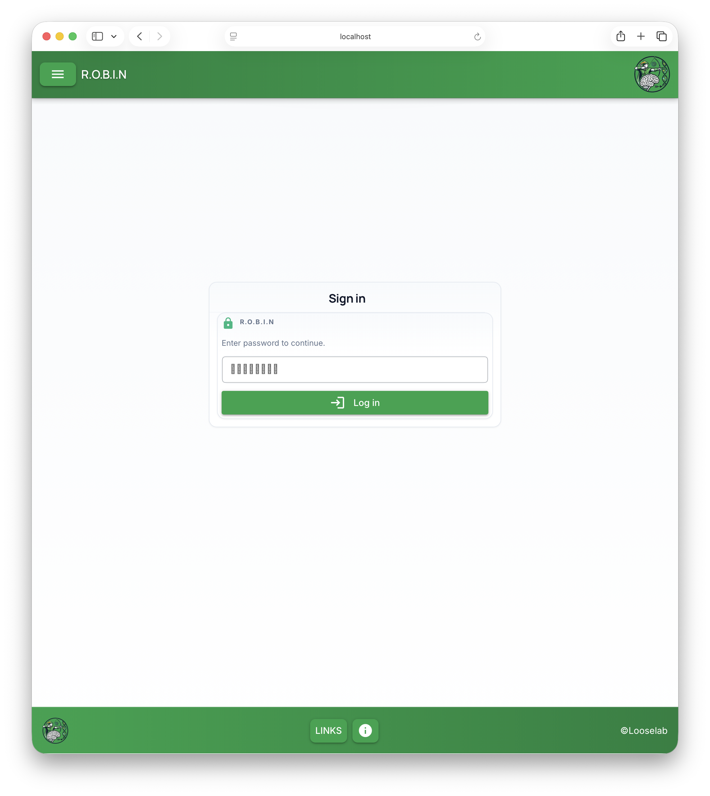

# First steps and navigation

## Opening ROBIN

Paste the address you were given into your browser’s address bar. It usually looks like `http://127.0.0.1:8081` or `http://localhost:8081`. If ROBIN runs on another machine, use the address your administrator provided (it may use a **host name** and **port**).

If nothing loads, see [Troubleshooting — I can’t open the page](troubleshooting.md#i-cant-open-the-page).

## Signing in

If your team enabled password protection, you’ll see a **Sign in** page with the ROBIN name and a short message: **Enter password to continue.** The screen includes the green header (**R.O.B.I.N**, menu, logo), the **Sign in** card with a lock icon, the **Password** field, the green **Log in** button, and the footer (**Links**, info, copyright).

- Type the password your team uses for the web interface (often the same one set when ROBIN first asked for a **GUI password** in the terminal).  
- Press **Log in** or Enter.

After a successful sign-in, ROBIN takes you to the page you originally tried to open, or to the **Welcome** home page.

## What’s at the top of every screen

- **Menu (☰)** on the left — opens the main navigation (see below).  
- **Title** — the full ROBIN name on large screens, or **R.O.B.I.N** on a phone.  
- **Viewing:** … — shows which computer the browser is talking to.  
- **CPU** and **RAM** — small gauges for a quick sense of load (they are **not** a full system monitor).  
- **Logo** — ROBIN branding on the right.

## Main menu (☰)

Use these entries to jump around the app:

| What you want to do | Choose |
|----------------------|--------|
| Go back to the home page | **Home** |
| See all samples in a table | **View Samples** |
| Build a new library ID from a test ID and optional details | **Generate Sample ID** |
| Add or remove folders that ROBIN should watch for new BAM files | **Watched Folders** *(may require your pipeline to be running in a specific mode—see the tour page)* |
| See whether the workflow is running and how jobs are progressing | **Activity Monitor** |
| Open published documentation in a new tab | **Documentation** |
| Make the whole app easier on the eyes at night | **Dark Mode** (toggle) |
| Allow remote access (advanced; your admin may use this) | **Allow Remote Access** |
| Leave the web session | **LOG OUT** |
| Fully quit ROBIN on this machine *(only on some setups)* | **Quit** — read the warning first; closing the **browser tab** often leaves analysis running, while **Quit** can stop it. |

!!! tip "Which “workflow” button?"
    Some menus list **Workflow** as a separate item. In the standard setup started from `robin workflow`, use **Activity Monitor** to see pipeline status and progress. If **Workflow** does nothing or shows an error, stick with **Activity Monitor**.

**Close** simply closes the menu.

## Footer: Links and info

At the bottom you’ll find **Links** — a panel with shortcuts to GitHub, key papers, the lab protocol, Oxford Nanopore, and related sites. Use **Info** if your build shows extra footer help.

## Quit vs closing the browser

If you see **Quit R.O.B.I.N?**, read the text carefully:

- **Cancel** — closes the dialog; analysis may continue.  
- **Really quit** — can stop analysis on that machine.  
- You can often **close the browser tab** and leave ROBIN running in the background—when in doubt, ask whoever operates the sequencer or server.

## Next

[Tour of the screens](pages-and-routes.md) walks through each page and what the buttons do.
