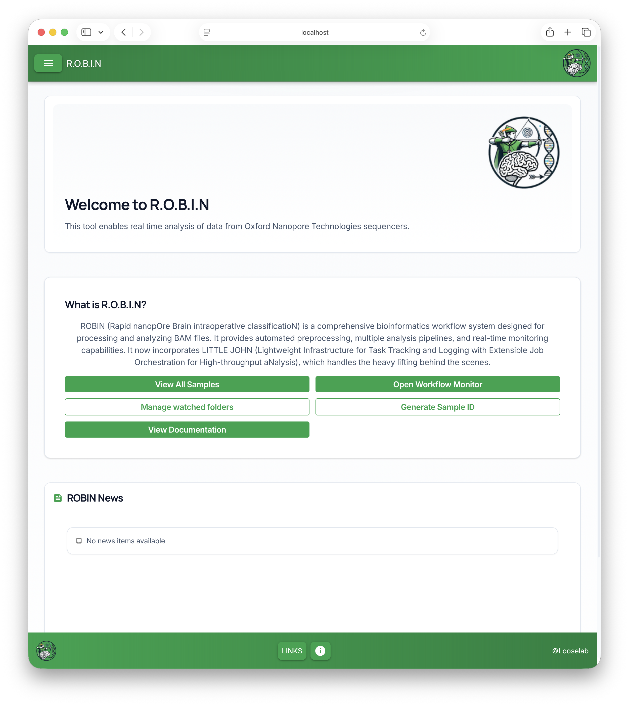
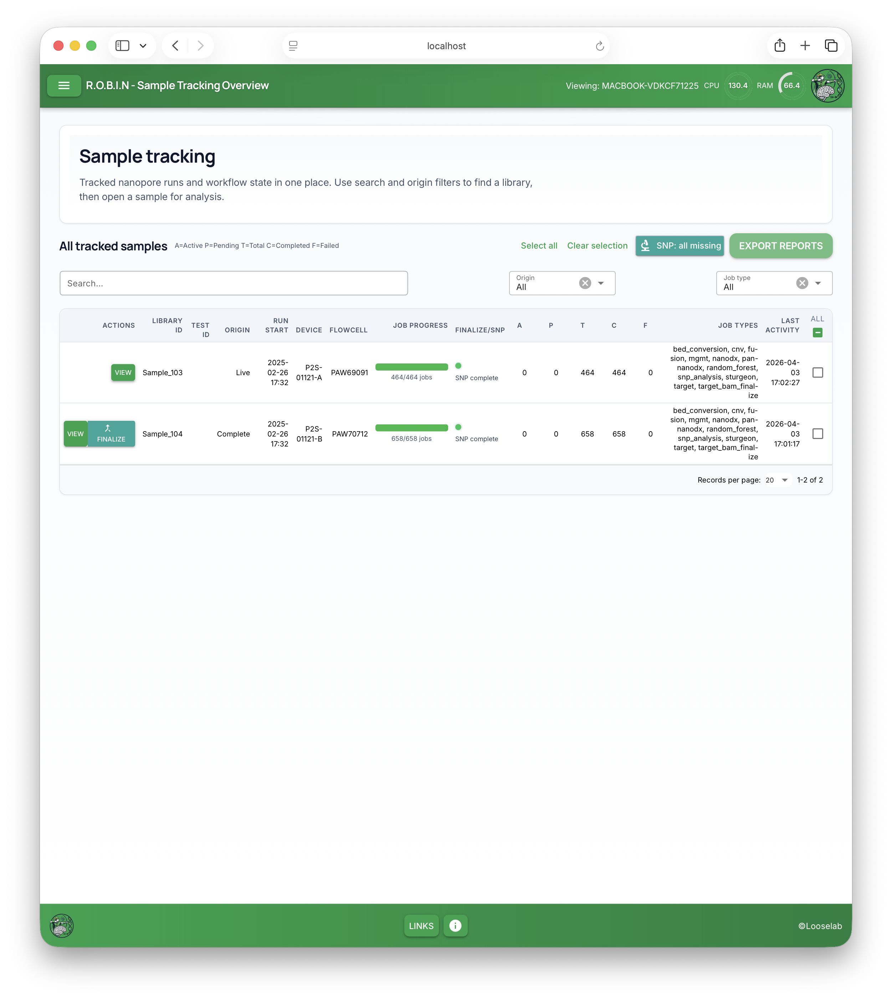
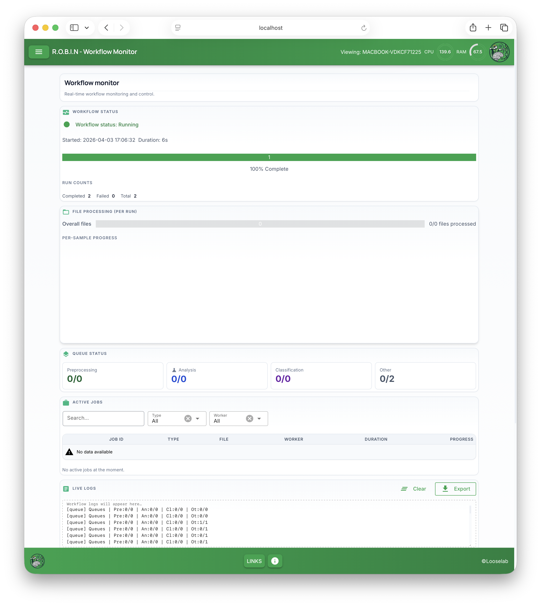
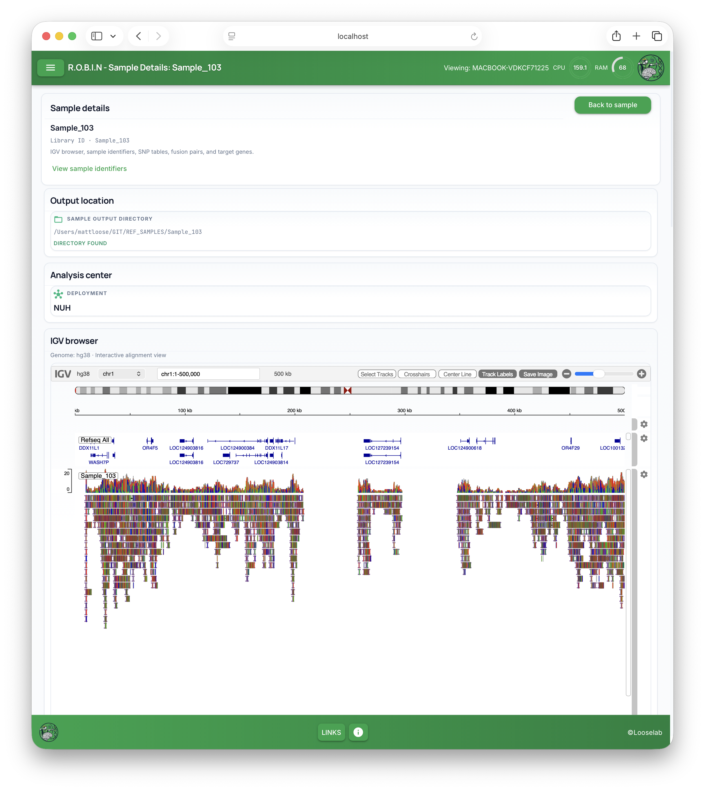
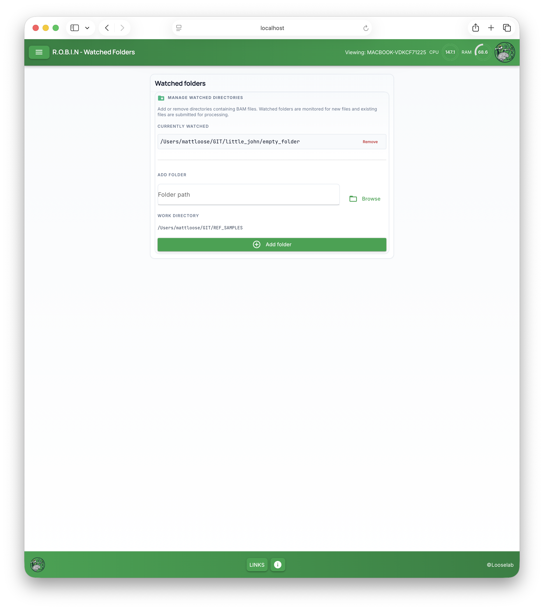
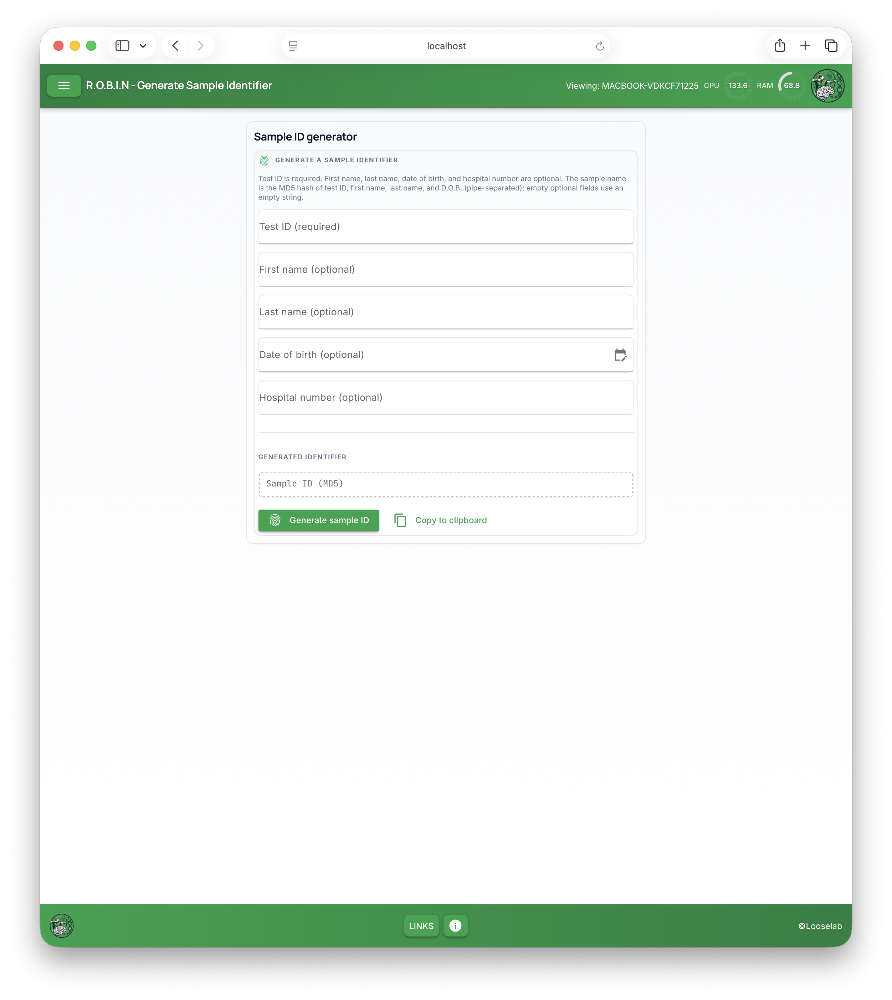

# Tour of the screens

This page walks through **what you see** and **where to click**, in the order most people use during a run. Technical paths (for bookmarks or IT) are noted in *italics* at the end of each section.

---

## Welcome (home)

**What it is:** The landing page after you sign in. It introduces ROBIN in plain language and explains that it analyses nanopore BAM data in real time.

**What to do here:**

- **View All Samples** — opens the big table of runs (see below).  
- **Open Workflow Monitor** — opens the **Activity Monitor** view so you can see whether the pipeline is busy and how far it has progressed.  
- **Manage watched folders** — for advanced users who need to add or remove input folders (see **Watched folders**).  
- **Generate Sample ID** — opens a small form to create a **library ID** from a test ID and optional patient fields.  
- **View Documentation** — opens the public documentation site in a new tab.

You may also see a **News** area with updates from the team.

*Bookmark path: home is the site root, e.g. `http://your-server:8081/`.*

---

## All samples (sample list)

**What it is:** A searchable table of **every sample** ROBIN is tracking—your main hub for finding a run. The browser title may read **Sample Tracking Overview**.

*Example only: the library IDs in this screenshot are anonymised samples from a quality-control exercise; your own list will show your runs.*

**What you’ll see:**

- A short intro: *Tracked nanopore runs and workflow state in one place…*  
- A heading **All tracked samples** and a legend such as **A=Active P=Pending T=Total C=Completed F=Failed** so you can read the status columns.  
- Buttons like **Select all** / **Clear selection** if you need to run bulk actions (your team may use these for SNP or other batch jobs).  
- In **Actions**, click **View** to open that sample’s **detail page** (clicking elsewhere on the row does not open it).

If a sample never appears, check that MinKNOW is writing BAMs where ROBIN expects them and that the run has started—your bioinformatics contact can confirm.

*Bookmark path: `/live_data`.*

---

## Activity Monitor (workflow monitor)

**What it is:** A dashboard for **overall pipeline health**: whether work is running, how long it has been up, and counts of completed or failed jobs. The browser title may read **Workflow Monitor**.

**What you’ll see:**

- **Workflow monitor** with the subtitle *Real-time workflow monitoring and control.*  
- A **Workflow status** card with a status line (for example “Running”), **Started** and **Duration**, a **progress** bar, and **Run counts** (such as completed / failed / skipped).  
- **File processing** — overall and per-sample progress when files are being handled.  
- **Queue status** — counts for preprocessing, analysis, classification, and other queues.  
- **Active jobs** — a searchable table of jobs when work is running (it can show “no data” when idle).  
- **Live logs** — scrollable output with **Clear** and **Export** for monitoring or sharing with support.

Use this when you want a quick “is ROBIN still working?” answer without opening a specific sample.

*Bookmark path: `/robin`.*

---

## One sample (detail page)

**What it is:** The page for a **single library ID**—this is where **Run summary**, **Classification details**, **Analysis details**, optional **MNP-Flex** results, and **reports** appear. Deeper tools on a follow-on screen (`/details`) are shown in [Sample details (extra tools)](#sample-details-extra-tools) below.

Open it from **All tracked samples** by clicking **View** on the row you want. That opens this **sample** page (`/live_data/<your-sample-id>`), not the **Workflow Monitor** (`/robin`); the monitor is described in [Activity Monitor](#activity-monitor-workflow-monitor) above.

**`OneSample.png`:** this repo image is another capture of the **Workflow Monitor** (`/robin`)—the same layout as `Activity.png`—not the `/live_data/<id>` page after **View**. The main sample screen is covered in [Reading your results](sample-results.md).

If ROBIN doesn’t recognise an ID yet, you may see **Unknown sample** and a short message that the library hasn’t been seen this session; the app will send you back to the list after a few seconds, or you can use **Back to samples**.

**Full walkthrough:** [Reading your results](sample-results.md).

*Bookmark pattern: `/live_data/<your-sample-id>`.*

---

## Sample details (extra tools)

**What it is:** A secondary page with **deeper tools** for that sample: where files live on disk, links into **IGV**, **sample identifiers**, **SNP** tables, **fusion** pairs, and **target genes**, depending on your configuration.

*Example only: any sample IDs or paths in this screenshot are from anonymised quality-control data; your page will reflect your run and configuration.*

Use **Back to sample** to return to the main sample page.

**What’s on the page:** step-by-step description of each block (paths, IGV, SNP, fusion pairs, target genes) is in [Reading your results → Sample details page](sample-results.md#sample-details-page-extra-tools).

*Bookmark pattern: `/live_data/<your-sample-id>/details`.*

---

## Watched folders

**What it is:** Lets you **add or remove directories** that contain BAM files so ROBIN can watch them for new data. The browser title may read **Watched Folders**.

*Example only: folder and work-directory paths in this screenshot are from a development machine; yours will match your deployment.*

**What you’ll see:**

- **Currently watched** — each path with **Remove** to stop watching it.  
- **Add folder** — type a path or use **Browse**, then **Add folder**.  
- **Work directory** — where ROBIN is using as the main output/work area (read-only context on this screen).

**Note:** On some setups this only works when ROBIN was started in a mode that supports folder management. If you see a message that **Ray** or the workflow is required, ask your administrator—this is not something most clinical users change during a run.

*Bookmark path: `/watched_folders`.*

---

## Sample ID generator

**What it is:** A form to build a **sample identifier** from:

- **Test ID** (required)  
- Optional: first name, last name, date of birth, hospital number  

**Use the same value in MinKNOW:** After you **Generate sample ID**, copy that **Sample ID (MD5)** and enter it as the **sample ID** for your sequencing run in **MinKNOW** (the field used to name the library and outputs). ROBIN expects BAMs and folders to use this identifier, so it can **match** the run to the manifest and tracking list **automatically**. Do not invent a different ID in MinKNOW if you already generated one here—use the **generated** ID verbatim.

The browser title may read **Generate Sample Identifier**.

**What you’ll see:**

- Short help text explaining required vs optional fields.  
- **Generate sample ID** — computes the identifier and fills the **Sample ID (MD5)** field.  
- **Copy to clipboard** — copies the generated ID when one exists.

**How it works:**

1. **Identifier string** — ROBIN builds a single line by joining, in order, **Test ID**, **First name**, **Last name**, and **Date of birth**, separated by **pipe characters** (`|`). Any optional field you leave blank is treated as an empty string between the pipes. The date of birth is formatted as **YYYY-MM-DD** when you pick a date.  
2. **MD5 hash** — The **Sample ID** is the **MD5** digest (hexadecimal) of that UTF-8 string. It is **deterministic**: the same inputs always produce the same ID.  
3. **Hospital number** — This is **not** included in the MD5 string. It is stored separately when ROBIN writes a **sample identifier manifest** next to your sample output (see below).  
4. **After generating** — If a **work directory** is configured, ROBIN creates a folder named with the new **sample ID** and writes a small manifest file there: **Test ID** is stored in plain text; **first name**, **last name**, **date of birth**, and **hospital number** (if provided) are stored **encrypted** so they can be recovered in a controlled way. If no work directory is set, you still get the MD5 ID, but the manifest step may not run—watch the on-screen notification.

Use this when your lab’s workflow expects a consistent naming scheme before or during a run.

*Bookmark path: `/sample_id_generator`.*

---

## Next

- [Reading your results](sample-results.md) — understand each block on the sample page.  
- [Troubleshooting](troubleshooting.md) — if something doesn’t look right.
