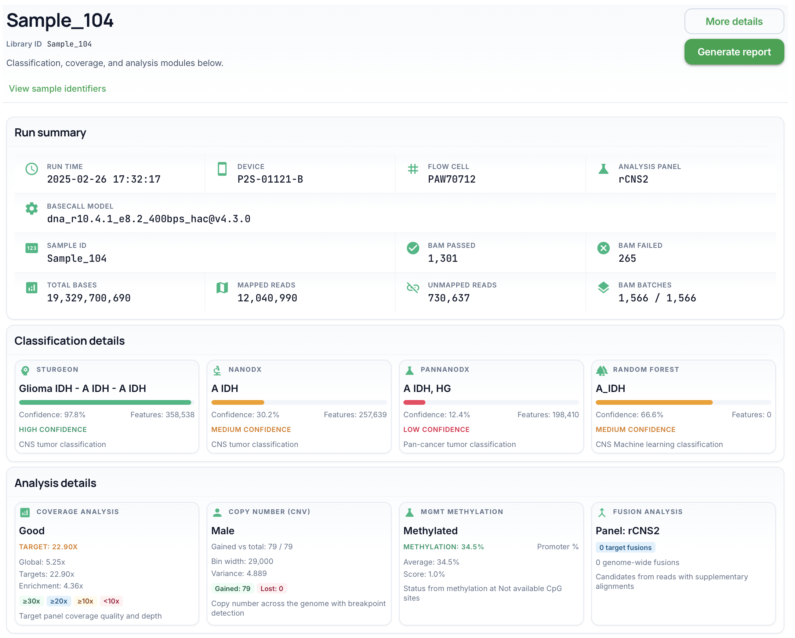
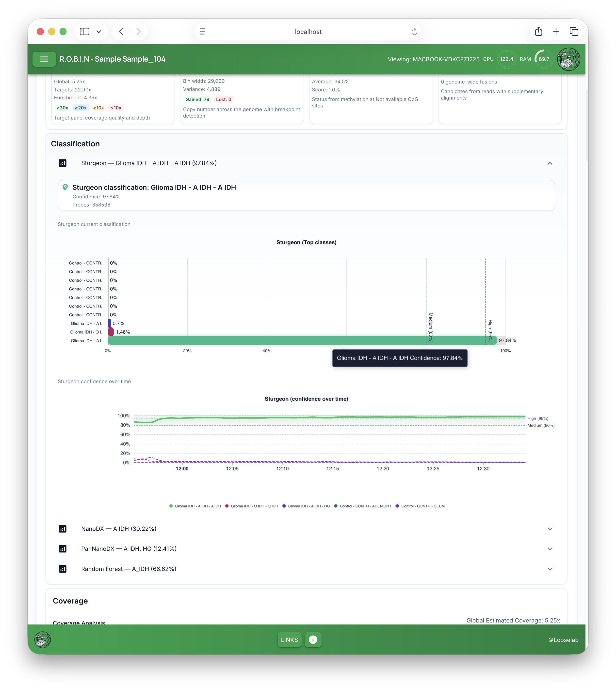
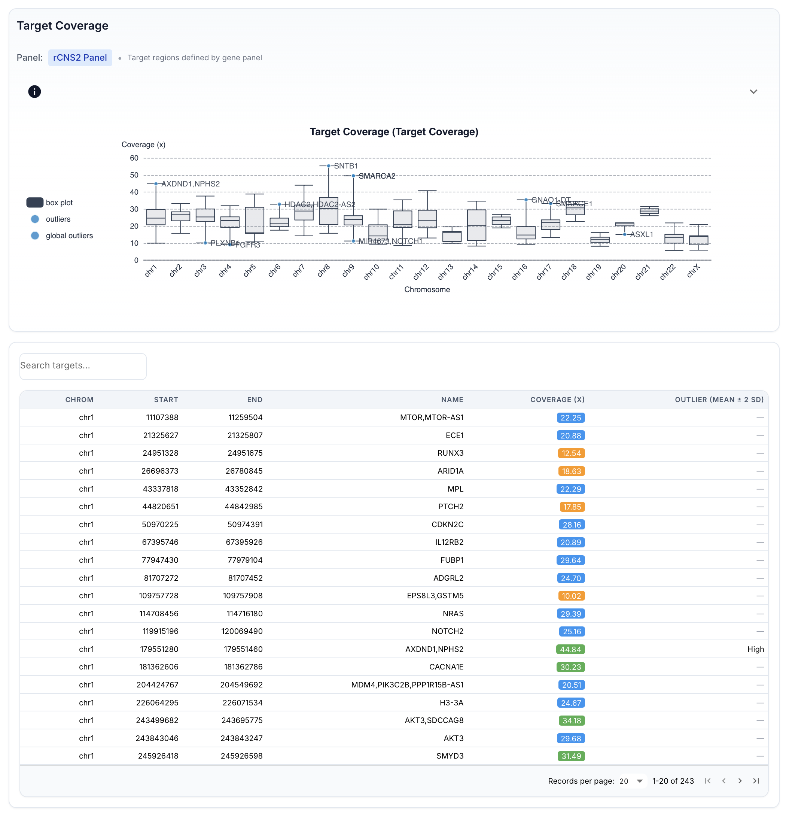
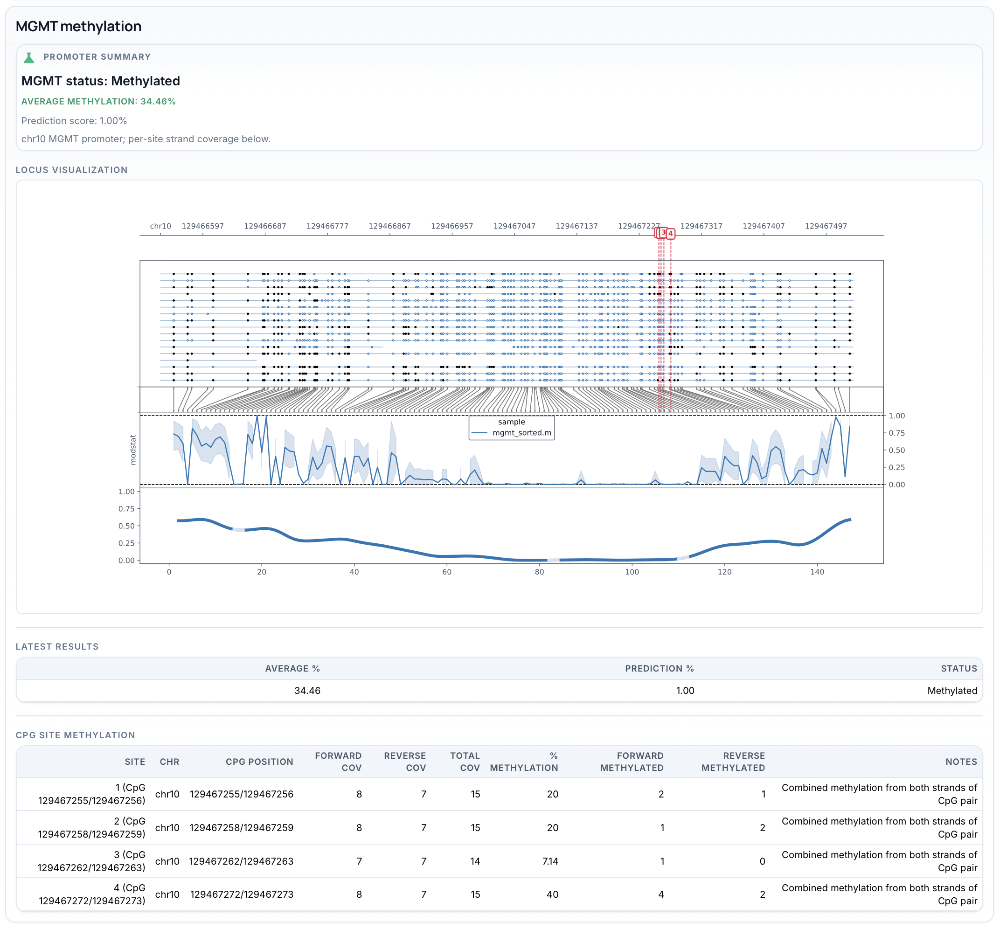
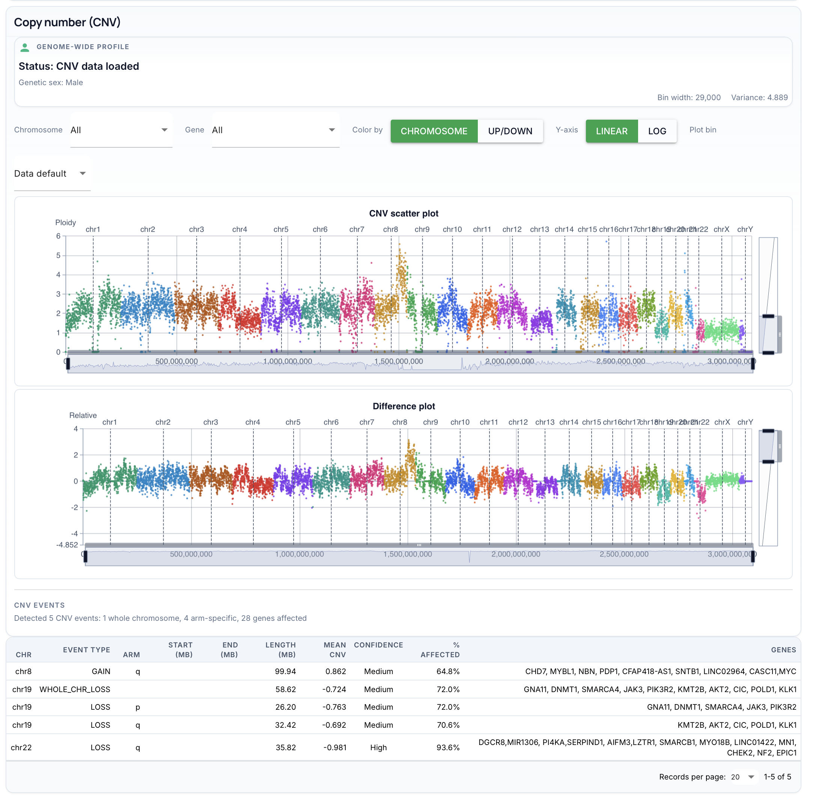
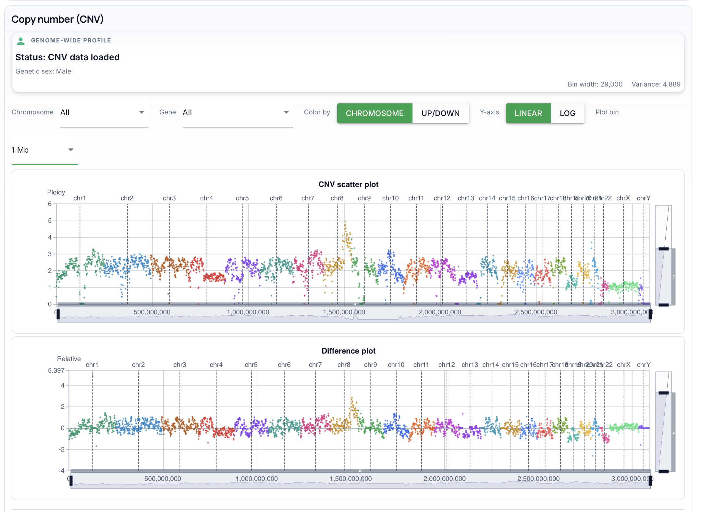
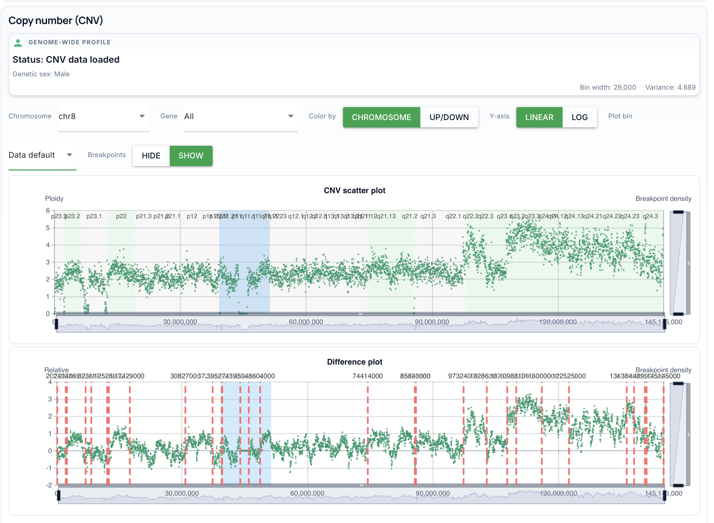
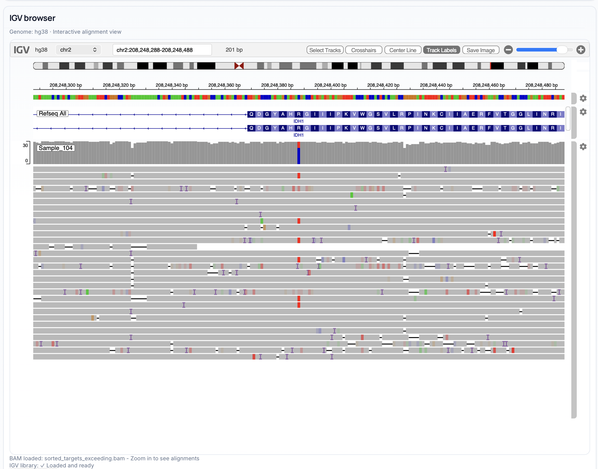
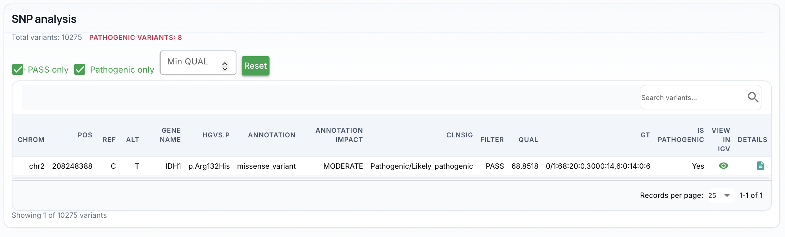
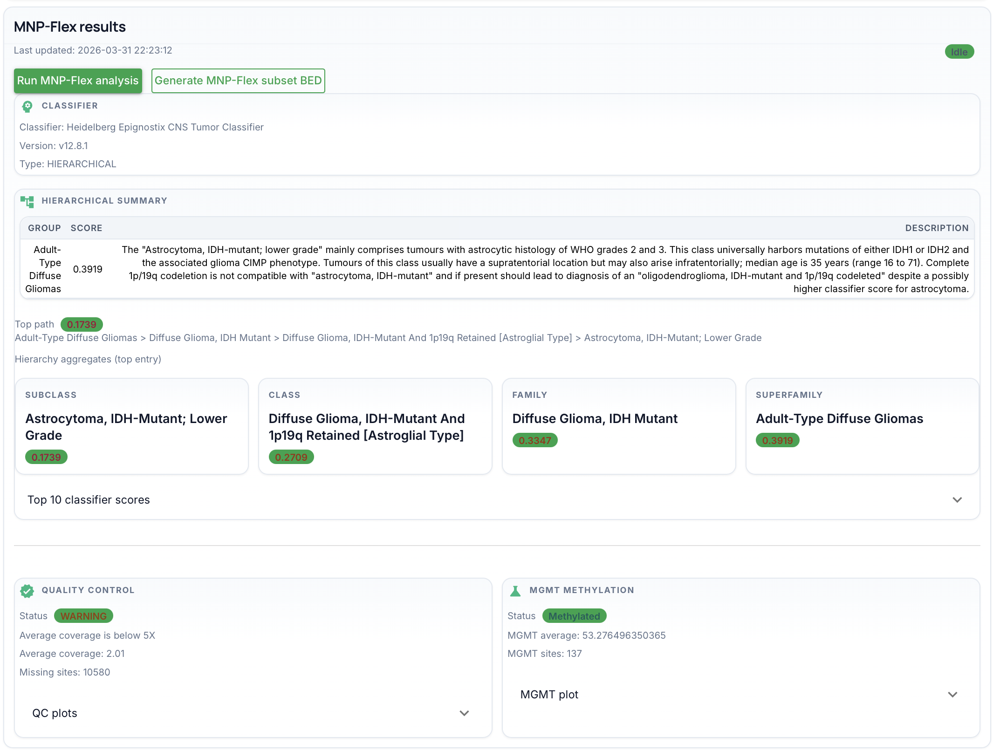

# Reading your results

This page explains **what each part of a sample page means** when you open a library from **All tracked samples** (use **View** on that row). The exact charts and numbers depend on which analyses your team enabled and how far the run has progressed. For a screenshot of the tracking table (with anonymised quality-control examples), see [All samples](pages-and-routes.md#all-samples-sample-list) in the tour.

*Example only: the library ID and metrics in this screenshot are from anonymised quality-control data; your page will reflect your run.*

---

## What you’ll see first: Run summary

**Run summary** is a block of **tiles** at the top—think of it as a **run card** for the sequencer:

- When the run started and how long it ran  
- Which **device** and **flow cell** were used  
- **Kit**, **basecalling** settings, and other technical metadata  

Use it to confirm you’re looking at the **right run** and **right patient** before you interpret biology below.

Long values (e.g. a full basecall model name) may wrap across the full width so nothing is cut off.

---

## Classification details

**Classification details** shows how different **classifiers** (for example Sturgeon, NanoDX, PanNanoDX, Random Forest) rank possible tumour classes or methylation-based groups.

**How to read it:**

- Each **card** gives a **main call** and a **confidence** level (often with a coloured bar).  
- **Higher confidence** usually means the model is more certain—but all results still need **clinical interpretation** by your team.  
- **Click a card** to jump to the **expanded section** below with **charts** (bar charts of top classes, and sometimes confidence over time).  
- Reference lines on charts may be labelled **Medium** and **High** to match your lab’s reporting thresholds.

Not every classifier appears for every run; it depends on your pipeline settings.

---

## Analysis details

**Analysis details** summarises **coverage**, **copy number (CNV)**, **MGMT methylation**, and **fusion** candidates in a **row of cards**.

**How to use it:**

- Skim the **headline** on each card (depth, CNV status, MGMT level, fusion counts).  
- **Click a card** to scroll to the **longer section** below with plots and tables for that topic.  
- **Coverage** — whether targets are sequenced deeply enough; your lab may use coloured bands or thresholds (e.g. sufficient vs low).  
- **CNV** — gains and losses; plots are for **visual review**—CNV calls are often heuristic.  
- **MGMT** — methylation at the MGMT promoter region; interpretation depends on your clinical protocol.  
- **Fusion** — candidate gene fusions; follow-up may use tables or genome views.

---

## Detailed results (full sections)

Below the **Classification details** and **Analysis details** cards, the sample page continues with larger blocks—each tied to the **same topic** as the card above. Your workflow may hide some blocks entirely.

### Classification

The heading **Classification** groups **Sturgeon**, **NanoDX**, **PanNanoDX**, and **Random Forest** in separate **expandable rows** (click to open).

*Example only: calls and charts are from anonymised quality-control data.*

- **Inside each tool:** a short **summary** (top call, confidence, probe or feature count where shown), then **charts**—typically a **bar chart of top classes** and, where available, **confidence over time** with **Medium** / **High** reference lines.  
- Use this area when you need **more than the dashboard card** shows: full class rankings and how stable the call was as the run progressed.  
- Which tools appear depends on your pipeline configuration.

### Coverage

The **Coverage** block starts with **Coverage Analysis**: an overall **quality** label plus **global** estimated coverage, **targets** estimated coverage, and **enrichment** (how much reads concentrate on targets vs genome-wide).

Further down you will usually find:

- **Per chromosome target coverage** — a chart comparing **on-target** vs **off-target** depth by chromosome.  
- **Coverage over time** — **cumulative** estimated depth (×) as the run advances.  
- **Target coverage over time** — mean target depth over time, with **outlier** highlighting (values beyond about **two standard deviations** from the mean per gene, as described on screen).

Use this section to judge whether sequencing depth is **adequate overall** and whether any time window or gene looks **anomalously low or high**.

### Target coverage

**Target coverage** is the **gene- and region-level** view for your **panel** (for example rCNS2, AML, PanCan—whatever your run used). You should see the **panel name**, a note that targets come from the **gene panel BED**, and often an **info** expansion with panel and BED file details.

*Example only: panel and gene labels are from anonymised quality-control data.*

**Gene amplifications:** this section is a good place to notice **suspected amplifications**—genes such as **MYC** or **EGFR** (when on your panel) may show up as **high-coverage outliers** on the per-chromosome plot (often **labelled** on the chart) and/or in the table’s **outlier** column (e.g. flagged relative to mean ± 2 SD). Treat these as **leads** to review alongside the **Copy number (CNV)** section and your lab’s clinical rules; unusually high target depth alone is **not** necessarily proof of amplification.

Typical contents include:

- **Per-chromosome** and **per-gene** views (including scatter, box-style, or bar plots of depth by region).  
- A **searchable table** of targets with coordinates, coverage (×), and outlier flags.  
- **Coverage distribution by gene** and any **threshold** bands your site uses to label sufficient vs low coverage.

Use it when you need **which genes or regions** drove the headline coverage number, not just the genome-wide average.

### MGMT methylation

**MGMT methylation** focuses on the **MGMT promoter** on chromosome 10.

*Example only: percentages and status are from anonymised quality-control data.*

- **Promoter summary** — **status** (for example methylated vs unmethylated), **average methylation** (%), **prediction score** where shown, and a short note that results come from **per-site** data.  
- **Locus visualization** — a plot of methylation along the promoter region.  
- Often a **table** of individual **CpG** sites with strand-specific coverage.

Interpretation is **protocol-specific**; treat this as supporting information alongside pathology and other assays.

### Copy number (CNV)

The UI uses the heading **Copy number (CNV)** for genome-wide copy-number views.

**Default (genome-wide):** with **Chromosome** and **Gene** set to **All**, you see the full genome on the **CNV scatter** (ploidy) and **difference** (relative) plots, plus sliders to pan and zoom. The **CNV events** table below lists segments (gain/loss, arms or whole chromosomes, affected genes, confidence).

*Example only: events and gene names are from anonymised quality-control data.*

**Plot bin:** the **Plot bin** menu (for example **Data default**, **500 kb**, **1 Mb**, …) **re-bins** the points used for plotting. Choosing a **larger** bin (such as **1 Mb**) often **smooths** noisy regions so **gains and losses** are easier to see at a glance; a **finer** bin can show more detail when you need it. Try a few settings while reviewing the same sample.

*Example: 1 Mb plot bin for visual inspection; your run may differ.*

**Single chromosome:** set **Chromosome** to one chromosome (for example **chr8**) to fill the plots with that chromosome only—**cytobands** and position on the X-axis make it easier to relate calls to **bands** and genes. Turn **Breakpoints** to **Show** when you want vertical guides at called **breakpoints** on the difference track.

*Example: focused chr8 view; anonymised QC data.*

**Also on screen:**

- **Genome-wide profile** card — **genetic sex**, **bin width**, **variance**, and **gained** / **lost** counts (aligned with the dashboard card).  
- **Controls** — **Colour by** chromosome vs up/down, **linear** or **log** Y-axis, **Plot bin**, **Breakpoints** show/hide when available.  
- **Main plots** — **CNV scatter** (ploidy) and **difference** (relative deviation) share genomic position; use together with the **events** table.

CNV here is for **rapid visual screening**; it is **not** a replacement for certified copy-number assays or expert review.

### Fusion analysis

**Fusion analysis** summarises candidates from reads with **supplementary alignments** (split mappings suggestive of rearrangements).

- **Candidate summary** — counts for **target panel** vs **genome-wide** pairs and groups.  
- **Target panel** — tables (and often plots) restricted to fusions involving your **assay panel**.  
- **Genome-wide** — broader fusion calls outside the panel, if configured.

Use the tables to inspect **gene pairs**, support, and grouping; follow your lab’s rules for **confirming** interesting events.

---

## Sample details page (extra tools)

This is a **separate URL** from the main sample dashboard: `/live_data/<library-id>/details`. Open it from **More details** on the main sample page (when shown) or via the [tour → Sample details](pages-and-routes.md#sample-details-extra-tools). The page focuses on **disk paths**, **IGV**, **identifiers**, and **tabular** SNP / fusion / target-gene views—not the large classification and analysis storyboards on `/live_data/<id>`.

### Page header

- **Sample details** heading with **library ID**; **Test ID** appears when ROBIN can read it from the sample’s **identifier manifest** on disk.  
- Intro line listing **IGV**, **sample identifiers**, **SNP** tables, **fusion pairs**, and **target genes**.  
- **View sample identifiers** — opens a modal with manifest-derived identifier fields (where configured).  
- **Back to sample** — returns to the main sample page (`/live_data/<library-id>`).

### Output location

- **Sample output directory** — full server path to this library’s folder under the ROBIN work directory; status shows **Directory found** or **not found** (with the expected path if missing).

### Analysis center

- On some installs, an **Analysis center** / **Deployment** card shows which ROBIN **center** or deployment label the browser session is using.

### IGV browser

- Embedded **IGV.js** genome browser (**Genome: hg38**): ruler, ideogram, reference sequence, gene annotations, coverage histogram, and read alignments.  
- **target.bam** must exist in the sample output folder for ROBIN to build the interactive viewer; otherwise you see **IGV requires target.bam** and a reminder to run **target analysis** first. When tracks load, ROBIN uses **target-scoped** indexed BAMs—typically **`target.bam`**, or (when present) files such as **`sorted_targets_exceeding.bam`** / **`sorted_targets_exceeding_rerun.bam`** under **`clair3/`**, or **`igv_ready.bam`** under **`igv/`**. **Only alignments from those target-region BAMs are shown**—this is **not** a whole-genome alignment view.  
- **SNP table**, **indel table** (when present), and **fusion pairs** table each offer **View in IGV** and/or **row clicks** that **move the browser** to the variant, indel, or fusion breakpoints so you can **inspect pileups** in the loaded BAM. The **Target genes** table does the same for each gene interval.  

*Example only: coordinates, gene, and BAM file name are from anonymised quality-control data.*

### SNP analysis

- Appears when SNP processing has written **`clair3/snpsift_output_display.json`**.  
- **Summary** text may include total variants and counts of **pathogenic** variants.  
- **Filters:** **PASS only** (keep rows with `FILTER` = PASS), **Pathogenic only**, optional **Min QUAL**, and **Reset** to clear filters. A **search** box filters the visible rows. The footer may show how many variants match (e.g. “Showing *n* of *N*”).  
- The **table** lists columns such as chromosome, position, **REF** / **ALT**, gene, **HGVS.p**, annotation, annotation impact, **ClinVar** significance (**CLNSIG**), **FILTER**, **QUAL**, genotype (**GT**), whether the row is **pathogenic**, **Details** (expand full fields), and **View in IGV**.  

*Example only: variant shown is from anonymised quality-control data; your counts and rows will differ.*

- **View in IGV** centres the embedded **IGV browser** (above on the page) on that variant for **pileup review**.  
- A separate **indel** table may appear when indel display rows exist, with the same filters; **View in IGV** there jumps the browser to the indel locus in the **same target-scoped BAM**.  
- If SNP analysis has not finished or the JSON is missing, you see a short **data not found** message instead of the table.

### Fusion pairs

- Built from processed fusion pickles (**`fusion_candidates_master_processed.pkl`** for the panel first, otherwise **`fusion_candidates_all_processed.pkl`** for genome-wide data).  
- **Table:** fusion pair name, both chromosomes, **breakpoint** coordinates, **supporting reads**, and **View in IGV**. **Click a row** or the action icon to jump the **IGV browser** to both breakpoint neighbourhoods (with padding) so you can **inspect supporting reads** in the **target BAM** (same embedded view as SNPs/indels).  
- Footer text may show **total fusions** and **total supporting reads**. Empty or missing data shows a clear **no pairs** / **run fusion first** style message.

### Target genes

- Data comes from **`target_coverage.csv`** if present, else **`bed_coverage_main.csv`**.  
- **Table:** gene name, chromosome, start, end, **coverage (×)** with colour **badges** by depth band, optional **search**, sortable columns, and **View in IGV**. **Click a row** to open that gene’s interval in IGV (with padding).  
- If neither file exists, this block is omitted.

Sections appear **only when** the underlying files exist and your **workflow** enables the relevant steps.

---

## MNP-Flex (if your site uses it)

**MNP-Flex** is provided commercially by **[Heidelberg Epignostix GmbH](https://epignostix.com/)**. You can only use it under an **agreement with Epignostix**; they supply the **account credentials** ROBIN needs to call their service.

Some sites show an **MNP-Flex results** block in the sample page. It may include:

- When results were last updated  
- **Classifier** name and version  
- A **hierarchical summary** (class / family / superfamily) and **quality** or **MGMT** side panels  

*Example of a successful test output: classifier metadata, hierarchy scores, QC status, and MGMT; your run will show its own values.*

A toolbar may show whether the integration is **idle**, **busy**, or **running**. If you never see this block, your deployment may not use MNP-Flex, or credentials may not be configured.

**Applying your Epignostix credentials in ROBIN:** The ROBIN process that runs the workflow and web UI reads **environment variables** on the **server** (not in the browser). Set the username and password Epignostix gave you before starting ROBIN, for example:

- **`MNPFLEX_USERNAME`** — your Epignostix user name  
- **`MNPFLEX_PASSWORD`** — your Epignostix password  

If either variable is missing, ROBIN does not show the MNP-Flex block and will not run the integration.

How you set them depends on your setup: typically export them in the shell before `robin …` - whoever operates the sequencing machine or server should make them **persistent** and **secure** (never commit them to git).

Your administrator may also tune optional settings (for example **`MNPFLEX_BASE_URL`**, **`MNPFLEX_WORKFLOW_ID`**, OAuth **`MNPFLEX_CLIENT_ID`** / **`MNPFLEX_CLIENT_SECRET`**, **`MNPFLEX_SCOPE`**) if Epignostix instructs you to; defaults match the standard Epignostix app integration.

---

## Reports and downloads

When analysis is far enough along, you can usually **generate a PDF report** for the sample. The file name is typically based on the **sample ID** and is saved under that sample’s output folder.

Your team may also offer **CSV** or **ZIP** exports of **tabular data**—if enabled, follow the on-screen options and wait for notifications to finish before closing the tab.

If a download fails, check the **notification** area and ask your administrator to confirm disk space and permissions.

---

## Important reminder

ROBIN is for **research use** and **support** to clinical decision-making. **Classification**, **CNV**, and **fusion** outputs are **not** a substitute for full pathological and molecular review by qualified staff.

## See also

- [Tour of the screens](pages-and-routes.md)  
- [Troubleshooting](troubleshooting.md)  
